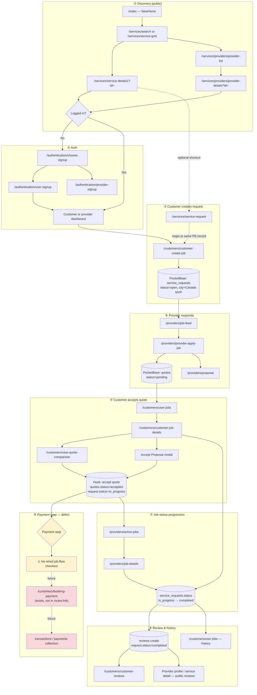
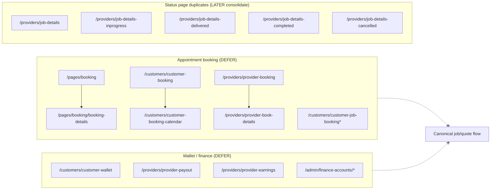

# GHST-10: Canonical Lif3line Demo Workflow & Competing Flow Prune Map

**Task:** Map canonical Lif3line demo workflow and prune competing flows
**Status:** Planning deliverable (analysis only — no file deletes, no deploy)
**Date:** 2026-06-21
**Depends on:** GHST-2 (routes), GHST-3 (schema), GHST-5 (discovery wired), GHST-9 (Canada-only)
**Repo:** `NewSite/`
**Router sources:** `src/feature-module/router/router.link.tsx`, `src/core/data/routes/all_routes.tsx`

---

## Executive summary

The template contains **three parallel product models**. Only one aligns with the Lif3line PocketBase MVP:

| Model | Template signal | PocketBase today | MVP decision |
|---|---|---|---|
| **Job / request / quote** | Customer jobs, provider job feed, proposals, quote comparison | `service_requests`, `quotes` | **Canonical — keep & wire (GHST-6)** |
| **Appointment booking** | Booking wizard, customer/provider booking calendars, job-booking pages | No `bookings` collection | **Defer — hide from nav; do not schema yet** |
| **Wallet / ledger payments** | Customer wallet, provider payout/earnings, admin finance | No wallet/transactions | **Defer — identify hook points only** |

**Canonical MVP journey:** Customer discovers service/provider (Canada cities only) → posts a **service request** → providers submit **quotes** → customer **accepts** one quote → job moves **`open` → `in_progress` → `completed`** → customer leaves **review** → history visible on jobs + reviews pages.

Payment is **not modeled** in PocketBase yet. The closest UI hooks are the “Confirm & Hire” modal (`customerJobDetails`) and unwired booking checkout pages (`booking-payment`, `booking-done`).

---

## 1. Workflow diagram

### 1.1 End-to-end (canonical MVP)



### 1.2 Competing flows (defer)



---

## 2. Route-by-route journey table

Legend: **Keep** = canonical MVP path · **Later** = post-MVP or consolidate · **Delete/demo** = template noise (do not wire; prune in GHST-7)

All location fields assume **Canada-only** cities from `cities` collection (GHST-9).

| Step | Route | Component | Role in journey | PocketBase | Rec | Notes |
|---|---|---|---|---|---|---|
| **1a** | `/index` | NewHome | Entry, discovery | `service_categories`, `services`, `provider_profiles`, `reviews`, `cities` | **Keep** | GHST-5 wired |
| **1b** | `/services/search` | Search | Search + category filter | `services`, `service_categories` | **Keep** | GHST-5 wired |
| **1c** | `/services/service-grid` | ServiceGrid | Listing layout | `services` | **Keep** | Primary grid; list layout duplicate → Later |
| **1d** | `/services/service-details/service-details1?id=` | ServiceDetails1 | Service detail | `services`, `reviews` | **Keep** | CTA → create job / request |
| **1e** | `/services/providers/provider-list` | ProvidersList | Provider directory | `provider_profiles` | **Keep** | GHST-5 wired |
| **1f** | `/services/providers/provider-details?id=` | ProviderDetails | Provider profile | `provider_profiles`, `services`, `reviews` | **Keep** | CTA → create job |
| **1g** | `/pages/categories` | Categories | Category browse | `service_categories` | **Keep** | Links to search |
| **2a** | `/authentication/choose-signup` | ChooseSignup | Role picker | `users` | **Keep** | |
| **2b** | `/authentication/login` | Login | Login | `users` auth | **Keep** | |
| **2c** | `/authentication/user-signup` | UserSignup | Customer register | `users` | **Keep** | Default role customer |
| **2d** | `/authentication/provider-signup` | ProviderRegister | Provider register | `users`, `provider_profiles` | **Keep** | |
| **2e** | `/authentication/forgot-password` | PasswordRecovery | Reset | auth | **Keep** | |
| **2f** | `/authentication/reset-password` | ResetPassword | Reset | auth | **Keep** | |
| **3a** | `/customers/customer-dashboard` | CustomerDashboard | Customer home | aggregated | **Keep** | Entry to jobs |
| **3b** | `/customers/customer-create-job` | CustomerCreateJob | **Primary request form** | `service_requests`, `cities`, `service_categories` | **Keep** | Canonical create; city = Canada MVP |
| **3c** | `/customers/customer-edit-job` | CustomerEditJob | Edit open request | `service_requests` | **Keep** | Only while `open` |
| **3d** | `/services/service-request` | ServiceRequest | Service-centric wizard | `service_requests` | **Later** | Overlaps 3b; appointment-style UX — repurpose as shortcut from service detail or defer |
| **3e** | Homepage `quote-modal` | QuoteModal | Quick quote popup | `service_requests` | **Later** | Wire to same PB create as 3b |
| **4a** | `/providers/dashboard` | ProviderDashboard | Provider home | stats | **Keep** | |
| **4b** | `/providers/job-feed` | ProviderJobFeed | Browse open jobs | `service_requests` (open) | **Keep** | Filter by category/city (Canada) |
| **4c** | `/providers/provider-apply-job` | ProviderApplyJob | Submit quote | `quotes` | **Keep** | Creates `quotes` |
| **4d** | `/providers/proposal` | ProviderProposal | Sent proposals list | `quotes` | **Keep** | |
| **5a** | `/customers/user-jobs` | UserJob | Job list / history | `service_requests` | **Keep** | Customer history hub |
| **5b** | `/customers/customer-job-details` | CustomerJobDetails | Job detail + proposals | `service_requests`, `quotes` | **Keep** | Accept modal here |
| **5c** | `/customers/user-quote-comparison` | UserQuoteComparison | Compare & accept | `quotes` | **Keep** | Side-by-side accept |
| **6a** | *(none wired)* | — | Job payment checkout | **missing collection** | **Later** | See §6 payment hooks |
| **6b** | `/customers/booking-payment` | BookingPayment | Checkout UI | — | **Later** | In `all_routes` only — **not in router.link** |
| **6c** | `/customers/booking-done` | BookingDone | Success UI | — | **Later** | Same — unwired |
| **7a** | `/providers/active-jobs` | ProviderActiveJobs | Provider active jobs | `service_requests` (in_progress) | **Keep** | |
| **7b** | `/providers/job-details` | JobDetails | Single job detail | `service_requests`, `quotes` | **Keep** | **One page**; drive status via data |
| **7c** | `/providers/job-details-inprogress` | JobDetailsInprogress | Status duplicate | same | **Later** | Consolidate into 7b |
| **7d** | `/providers/job-details-delivered` | JobDetailsDelivered | Status duplicate | same | **Later** | Consolidate into 7b |
| **7e** | `/providers/job-details-completed` | JobDetailsCompleted | Status duplicate | same | **Later** | Consolidate into 7b |
| **7f** | `/providers/job-details-cancelled` | JobDetailsCancelled | Status duplicate | same | **Later** | Consolidate into 7b |
| **8a** | `/customers/customer-reviews` | CustomerReviews | Review history | `reviews` | **Keep** | List; add “leave review” on completed job |
| **8b** | `/customers/settings/customer-profile` | CustomerProfile | Profile | `users`, `cities` | **Keep** | Canada city relation |
| **8c** | `/providers/provider-review` | ProviderReview | Reviews received | `reviews` | **Later** | Provider-side mirror |
| **8d** | `/providers/provider-service` | ProviderServices | Manage listings | `services` | **Keep** | Discovery supply side |
| **8e** | `/providers/settings/provider-profile-settings` | ProviderProfileSettings | Edit profile | `provider_profiles` | **Keep** | |

### Routes explicitly **not** in canonical journey

| Route group | Example paths | Rec | Reason |
|---|---|---|---|
| Appointment booking | `/pages/booking`, `/customers/customer-booking`, `/customers/customer-booking-calendar`, `/providers/provider-booking`, `/providers/provider-book-details` | **Later** | Competes with job/quote model; no PB `bookings` |
| Job-booking hybrid | `/customers/customer-job-booking`, `/customers/user-job-booking-details`, `/customers/user-job-booking-completed` | **Later** | Naming implies booking; confuses MVP |
| Wallet / payouts | `/customers/customer-wallet`, `/providers/provider-payout`, `/providers/provider-earnings`, `/providers/provider-transaction` | **Later** | No wallet schema |
| Admin finance | `/admin/finance-accounts/*`, `/admin/payouts/*`, `/admin/customer-wallet` | **Later** | Ops phase |
| Provider SaaS | `/providers/provider-subscription`, signup payment/subscription | **Delete/demo** | Template SaaS, not marketplace MVP |
| Home variants | `/index-2` … `/index-12` | **Delete/demo** | GHST-7 |
| Duplicate listings | `/services/service-list`, `/services/service-details/service-details2` | **Later** | Pick one layout (grid + details1) |
| Chat / notifications | `/customers/customer-chat`, `/providers/provider-chat` | **Later** | Out of GHST-3 scope |
| Misplaced customer routes | `/providers/customer/customer-list` in customer group | **Delete/demo** | Wiring bug (GHST-2) |

---

## 3. PocketBase collection needs by step

| Step | User action | Collections read | Collections write | Status / rules |
|---|---|---|---|---|
| Discovery | Browse homepage, search, profiles | `cities`, `service_categories`, `services`, `provider_profiles`, `reviews` | — | Public read; Canada filter on `cities.country='Canada'` |
| Auth | Sign up / log in | `users` | `users`, `provider_profiles` (provider signup) | Role guard hooks |
| Create request | Post job | `service_categories`, `cities` | `service_requests` | `status=open`, `customer=auth`, city ∈ Canada seed |
| Provider browse | Job feed | `service_requests` | — | Providers see `open` only |
| Submit quote | Apply / propose | `service_requests`, `provider_profiles` | `quotes` | `status=pending`, unique (request, provider) |
| Compare quotes | Quote comparison | `quotes`, `provider_profiles` | — | Customer owns request |
| Accept quote | Hire provider | `quotes`, `service_requests` | `quotes`, `service_requests` | **Hook:** accept one → reject others → `in_progress` |
| Payment | Pay for accepted quote | *(future)* `payments` or `transactions` | *(future)* | Not in GHST-3; stub UI only |
| Work in progress | Provider works job | `service_requests`, `quotes` | `service_requests` | `in_progress` |
| Complete job | Mark done | `service_requests` | `service_requests` | `completed`; enables review validation |
| Leave review | Rate provider/service | `service_requests`, `provider_profiles`, `services` | `reviews` | `request.status=completed`; updates rating aggregates |
| History | View past jobs/reviews | `service_requests`, `quotes`, `reviews` | — | Customer list + review page |

**Collections that exist today (GHST-3):** `users`, `cities`, `service_categories`, `provider_profiles`, `services`, `service_requests`, `quotes`, `reviews`.

**Collections needed later (not GHST-10):** `payments` / `transactions`, optional `bookings` (only if product pivots), `notifications`, `messages`.

---

## 4. Competing duplicate flows

### 4.1 Job / request / quote flow (canonical)

**Template pages:** `customerCreateJob`, `userJob`, `customerJobDetails`, `userQuoteComparison`, `providerJobFeed`, `providerApplyJob`, `providerProposal`, `providerActiveJobs`, `jobDetails*`

**Strengths:** Matches PocketBase schema and GHST-6 scope; clearest marketplace “post job → get quotes → hire” narrative; accept/hire UI already in `customerJobDetails` modal and quote comparison.

**Weaknesses:** No payment step after accept; `service-request` wizard looks like appointment booking; five `job-details-*` routes duplicate one concern.

### 4.2 Appointment booking flow (defer)

| Route | Wired? | Competes with |
|---|---|---|
| `/pages/booking` | Yes | Direct slot booking vs open request |
| `/pages/booking/booking-details` | Yes | Job detail |
| `/customers/customer-booking` | Yes | `user-jobs` |
| `/customers/customer-booking-calendar` | Yes | N/A for quote model |
| `/providers/provider-booking` | Yes | `active-jobs` |
| `/providers/provider-book-details` | Yes | `job-details` |
| `/customers/customer-job-booking` (+ details/completed) | Yes | **Naming collision** with job flow |

**Recommendation:** Do not add `bookings` collection for MVP. Remove from primary nav in GHST-7; keep routes unwired from CTAs.

### 4.3 Wallet / payment flow (defer)

| Route | Wired? | Purpose |
|---|---|---|
| `/customers/customer-wallet` | Yes | Customer balance / top-up |
| `/customers/booking-payment` | **No** (all_routes only) | Checkout |
| `/customers/booking-done` | **No** | Success |
| `/providers/settings/payment-setting` | Yes | Provider payout config |
| `/providers/provider-payout` | Yes | Withdraw |
| `/providers/provider-earnings` | Yes | Earnings dashboard |
| `/providers/provider-transaction` | Yes | Ledger |
| `/admin/finance-accounts/*`, `/admin/setting/payment-*` | Yes | Admin ops |

**Recommendation:** Defer schema and wiring. Reuse checkout **UI** from `booking-payment.tsx` when payments land.

### 4.4 Provider dashboard flow (consolidate)

Two parallel “my work” surfaces:

| Surface | Routes | Model |
|---|---|---|
| **Job marketplace** | `job-feed`, `active-jobs`, `job-details`, `proposal` | Request/quote — **Keep** |
| **Appointment ops** | `provider-booking`, `provider-book-details`, `provider-availability`, `provider-holiday`, `staff/*` | Scheduling — **Later** |
| **Finance ops** | `provider-earnings`, `provider-payout`, `provider-transaction` | Wallet — **Later** |

**Duplicate job detail pages:** Five status-specific routes (`job-details-inprogress`, `-delivered`, `-completed`, `-cancelled`) should become **one** `job-details` with status-driven sections (GHST-7 cleanup).

---

## 5. MVP recommendation

### 5.1 Choose one flow

**Adopt: Job / request / quote** end-to-end. It is the only flow with PocketBase collections and matches the target journey through review (payment excepted).

### 5.2 Defer conflicting flows

| Flow | Action |
|---|---|
| Appointment booking | Hide from nav/CTAs; no new collections; do not link from discovery pages |
| Job-booking hybrid pages | Treat as booking deferrals; rename/link in GHST-7 |
| Wallet / payouts / admin finance | No wiring in GHST-6; pages remain demo |
| Provider subscription / signup payment | Ignore for MVP |
| Five `job-details-*` variants | Use `job-details` only in GHST-6; others Later |

### 5.3 Primary vs secondary entry for “request service”

| Entry | Route | MVP role |
|---|---|---|
| **Primary** | `/customers/customer-create-job` | Full job post (category, budget, **Canadian city**, description) |
| **Secondary** | `/customers/customer-job-details` ← from service/provider CTA | Pre-fill category/service/provider context (GHST-6) |
| **Defer** | `/services/service-request` | Wizard duplicates booking UX; keep file, don’t promote in nav |

### 5.4 Missing payment hook points

Payment is the largest gap between template UI and MVP schema.

| Hook location | File / route | Current behavior | Recommended future action |
|---|---|---|---|
| Accept proposal | `customers/user-Job/modal.tsx` — “Confirm & Hire” | Closes modal; no navigation | On accept → redirect to checkout or mark “payment_pending” |
| Quote comparison accept | `userQuoteComparison.tsx` — “Accept Proposal” | Static buttons | Same as above |
| Checkout page | `pages/booking/booking-payment.tsx` → `routes.bookingPayment` | **Not registered in router.link** | Wire route + adapt copy for “Pay for job #…” |
| Success page | `pages/booking/booking-done.tsx` | **Not wired** | Post-payment confirmation |
| Customer wallet | `/customers/customer-wallet` | Separate ledger demo | Later: link from history, not primary checkout |
| Provider payout | `/providers/provider-payout` | After earnings | Later: after `payments` + platform fee model |
| Admin gateways | `/admin/setting/payment-gateways` | Stripe/PayPal config | Later: ops |

**Minimal MVP payment stance (GHST-6):** Accept quote → `in_progress` with **no card capture** (offline / pay-on-site), OR add `payments` collection + wire `booking-payment` in a follow-up task. Document chosen path in GHST-6.

### 5.5 Status model (single source of truth)

Use `service_requests.status` only:

```
open → in_progress → completed
         ↘ cancelled
```

Use `quotes.status`: `pending → accepted | rejected | withdrawn`.

Do **not** mirror status as separate routes; drive UI badges from PB fields.

### 5.6 Canada-only enforcement in workflow

| Step | Rule |
|---|---|
| Discovery | Filter/display `cities` where `country='Canada'` (GHST-5/9) |
| Create job | `city` relation → MVP city list; free-text `location` should include Canadian address context |
| Provider profile | `provider_profiles.city` → Canada cities |
| Search/filter | No US/UK demo strings in MVP paths (GHST-7 sweep) |

---

## 6. GHST-6 handoff (next implementation task)

Wire these routes to PocketBase in order:

1. Auth + role guard
2. `customer-create-job` → `service_requests`
3. `user-jobs` / `customer-job-details`
4. `provider-job-feed` / `provider-apply-job` → `quotes`
5. Accept quote hook (PB hook or API rule)
6. `active-jobs` / `job-details` status updates
7. Review create on completed jobs → `customer-reviews`

**Do not** wire booking calendar, wallet, or duplicate job-details routes in GHST-6.

---

## 7. References

- [GHST-2 route inventory](./GHST-2-route-inventory-and-schema.md)
- [PocketBase MVP schema](./pocketbase-mvp-schema.md)
- [Canada location scope](./canada-location-scope.md)
- [GHST-5 discovery wiring](./GHST-5-pocketbase-discovery.md)
