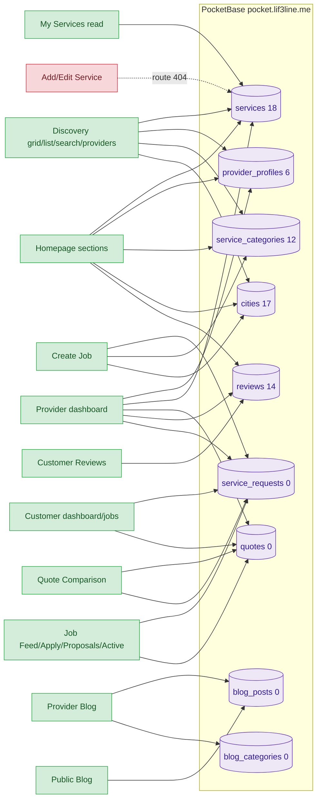
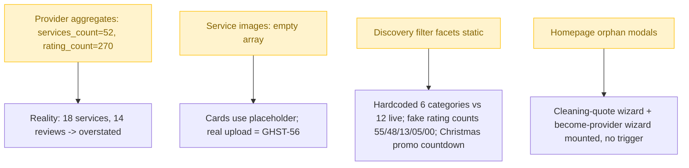

# Entrypoint knowledge graph v2 (GHST-54)

Mermaid views of the role → shell → surface → PocketBase mapping. Machine-readable
version: `knowledge-graph.json`. Status colors: 🟢 live · 🟡 mock · ⬜ demo ·
🔴 broken · 🔵 future.

## 1. Roles → shells → surface groups

```mermaid
flowchart TD
  GUEST([Guest]):::role
  CUST([Customer]):::role
  PROV([Provider]):::role

  GUEST --> GH[Public header + footer]:::live
  GUEST --> HOME[/index live sections/]:::live
  GUEST --> DISC[Discovery: grid/list/search/providers/details]:::live
  GUEST --> BLOGP[Blog grid/list/details published]:::live
  GUEST --> MKTG[Marketing+legal: about/how/pricing/faq/contact/privacy/terms]:::demo
  GUEST --> TMPL[Alt homes index-2..12 + booking/categories demos]:::demo

  CUST --> CSH[Customer shell header + full sidebar]:::live
  CSH --> CLIVE[Dashboard / Create Job / Jobs / Job Details / Quote Comparison / Reviews]:::live
  CSH --> CFUT[Bookings / Job Bookings / Favorites / Wallet]:::future
  CSH --> CCHAT[Chat]:::demo
  CSH --> CSET[Settings: profile/security/notifications/connected-apps]:::demo
  CSH --> CNOTIF[Header notifications -> customerNotifications]:::broken

  PROV --> PSH[Provider shell header + full sidebar]:::live
  PSH --> PLIVE[Dashboard / My Services read / Job Feed / Apply / Proposals / Active Jobs / Job Detail / Blog]:::live
  PSH --> PADD[My Services -> Add/Edit Service]:::broken
  PSH --> PMOCK[Staffs / Customers / Payout / Holidays / Coupons / Offers / Enquiries / Verification]:::mock
  PSH --> PDEMO[Bookings / Reviews / Earnings / Subscription / Settings / Job-detail variants]:::demo
  PSH --> PCHAT[Chat]:::demo

  classDef role fill:#222,color:#fff,stroke:#000;
  classDef live fill:#d4edda,stroke:#28a745,color:#155724;
  classDef mock fill:#fff3cd,stroke:#ffc107,color:#856404;
  classDef demo fill:#e2e3e5,stroke:#6c757d,color:#383d41;
  classDef broken fill:#f8d7da,stroke:#dc3545,color:#721c24;
  classDef future fill:#cce5ff,stroke:#007bff,color:#004085;
```

## 2. Live surfaces → PocketBase collections

## 3. Data-honesty hotspots (GHST-55 targets)

## Notes

- Counts in `()` are the live PB totals at audit time; they update as data is
  created. 0-count collections (requests/quotes/blog) render honest empty states.
- 🔴 `PADD` (Add/Edit Service) is the one broken edge on an otherwise-live
  provider flow — fix = register the route (GHST-56).
