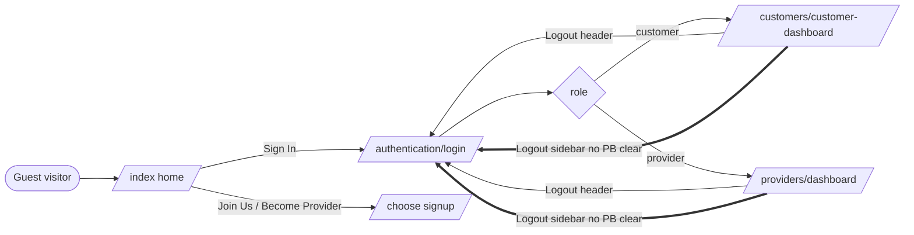
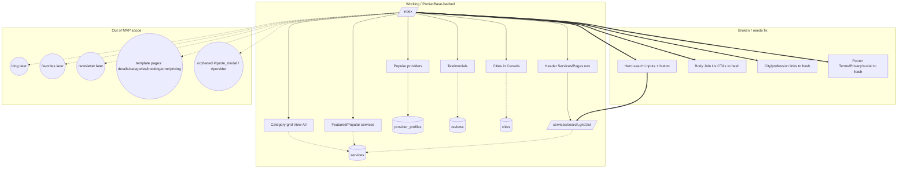
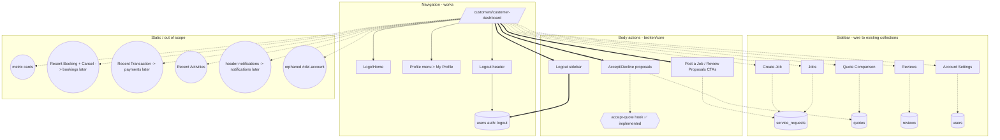
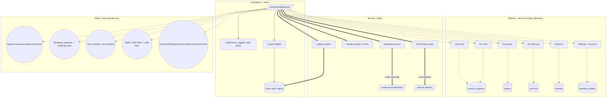

# Entrypoint flow graph (GHST-35)

Visualizes how the mapped entrypoints (GHST-31/32/33) connect surfaces → destinations → PocketBase collections, and where flows are broken or out-of-scope.

Inputs: `homepage-entrypoints.md`, `customer-dashboard-entrypoints.md`, `provider-dashboard-entrypoints.md`, `entrypoint-classification-summary.md`. Machine-readable version: `entrypoint-flow-graph.json`.

**Edge legend**
- solid `-->` = working navigation/action (keep)
- `-.->` = needs wiring to an existing collection (wire)
- `==>` broken/no-op or cross-role leak (fix)
- dashed to `((later))` = out-of-MVP-scope destination (hide/delete-later)

---

## 1. Top-level surface map

## 2. Home page entrypoint flow

## 3. Customer dashboard entrypoint flow

## 4. Provider dashboard entrypoint flow

## 5. Canonical MVP workflow (target wiring)

The job → quote → review loop spanning both roles, using **existing collections only**:

```mermaid
flowchart LR
  CCreate[Customer: Create Job] -.-> SRq[(service_requests<br/>status=open)]
  SRq -.-> PFeed[Provider: Job Feed]
  PFeed -.-> PSubmit[Provider: Submit Proposal] -.-> Qt[(quotes)]
  Qt -.-> CCompare[Customer: Quote Comparison]
  CCompare -.-> CAccept[Customer: Accept]
  CAccept -.-> AQ{{accept-quote hook ✅:<br/>quote=accepted, others rejected,<br/>request=in_progress}}
  AQ -.-> PMyJobs[Provider: My Jobs]
  PMyJobs -.-> CJob{{complete-request hook ✅:<br/>request=completed}}
  CJob -.-> CReview[Customer: leave Review] -.-> Rv[(reviews ✅ validation hook)]
  Rv -.-> RAgg{{rating aggregate recompute<br/>⏳ deferred}}
  RAgg -.-> PPf[(provider_profiles.rating)]
```

> Every node in §5 maps to a collection that **already exists** (`service_requests`, `quotes`, `reviews`, `provider_profiles`). Hook status (GHST-12): `accept-quote`, `complete-request`, `cancel-request`, and review validation are **implemented ✅**; only the **rating-aggregate recompute is deferred ⏳**. Remaining MVP work = frontend wiring to these existing hooks/collections. See `pocketbase-backlog-from-entrypoints.md` Tier 1.

---

## How to read these graphs

- **Solid edges** are safe to demo today.
- **Dotted edges into collection nodes** `[( )]` are the MVP wiring backlog (Tier 1).
- **`==>` edges** are the broken/leak fixes to do before any demo.
- **`(( ))` nodes** are out-of-scope; hide their entrypoints from nav (don't delete) per `demo-cleanup-candidates.md`.

A machine-readable node/edge listing is in `entrypoint-flow-graph.json` (nodes carry `surface`, `classification`, `decision`, `pb`; edges carry `kind` = nav | wire | broken | scope).
