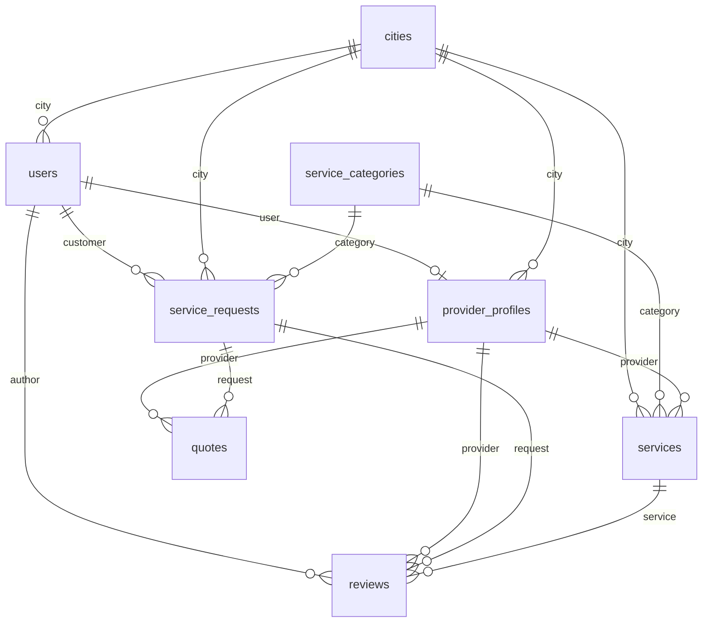

# Lif3line MVP PocketBase Schema

**Task:** GHST-3 — Create MVP PocketBase collections and access rules
**Backend:** https://pocket.lif3line.me
**API base:** https://pocket.lif3line.me/api
**Source:** [GHST-2 route inventory](./GHST-2-route-inventory-and-schema.md)
**Migration:** `pocketbase/pb_migrations/1740523500_lif3line_mvp_schema.js`
**Applied on VM:** 2026-06-21 (`pocketbase migrate up`)

## Product scope

This schema supports the **job / request / quote** marketplace flow only.

**In scope:** auth roles, cities, categories, provider profiles, services, customer service requests, provider quotes, reviews.

**Explicitly out of scope (GHST-3):** appointment `bookings`, chat/messages, notifications, wallet/payouts/subscriptions.

---

## Collections overview

| Collection | Type | Public read | Primary actors |
|---|---|---|---|
| `users` | auth | No (owner/admin) | all |
| `cities` | base | Yes | admin write |
| `service_categories` | base | Yes | admin write |
| `provider_profiles` | base | Active profiles only | provider owner, admin |
| `services` | base | Active services only | provider owner, admin |
| `service_requests` | base | Owner; providers see `open` | customer owner, providers, admin |
| `quotes` | base | Request customer + quoting provider | provider create, customer read |
| `reviews` | base | `published` only | customer author, admin |

---

## 1. `users` (auth — extended)

Built-in PocketBase auth collection extended with Lif3line profile/role fields.

| Field | Type | Required | Notes |
|---|---|---|---|
| `email` | email | yes | Built-in |
| `password` | — | signup | Built-in |
| `role` | select | yes | `customer`, `provider`, `admin` |
| `name` | text | no | Display name |
| `phone` | text | no | |
| `avatar` | file | no | jpeg/png/webp/gif, max 5 MB |
| `city` | relation → `cities` | no | |
| `verified` | bool | no | Email/phone verified flag |

### Access rules

| Rule | Expression |
|---|---|
| list | `@request.auth.id != "" && (@request.auth.id = id \|\| @request.auth.role = "admin")` |
| view | same as list |
| create | `""` (public signup enabled) |
| update | `@request.auth.id != "" && (@request.auth.id = id \|\| @request.auth.role = "admin")` |
| delete | `@request.auth.role = "admin"` |

### Signup notes (hook required — GHST-4+)

Public signup is enabled. A **`users` create hook** should:

- Default `role` to `customer` when omitted
- Reject `role = "admin"` from non-admin callers
- Optionally auto-create `provider_profiles` when `role = "provider"`

---

## 2. `cities`

Canada-only for MVP (GHST-9). Seed exactly the 17 MVP cities — see `docs/canada-location-scope.md` and `src/core/data/locations/canada-locations.ts` (`pocketBaseCitySeed`).

Reference data for location filters and profile/job city fields.

| Field | Type | Required | Notes |
|---|---|---|---|
| `name` | text | yes | City name, e.g. Toronto |
| `slug` | text | yes | unique, e.g. `toronto-on` |
| `region` | text | no | Province/territory code: `ON`, `QC`, `BC`, … |
| `country` | text | no | Always `Canada` for MVP seed |

### Access rules

| Rule | Expression |
|---|---|
| list / view | `""` (public) |
| create / update / delete | `@request.auth.role = "admin"` |

### Indexes

- Unique: `slug`
- Index: `name`

---

## 3. `service_categories`

Service taxonomy for homepage, search filters, and job categorization.

| Field | Type | Required | Notes |
|---|---|---|---|
| `name` | text | yes | |
| `slug` | text | yes | unique |
| `icon` | file | no | svg/png/jpeg/webp |
| `listing_count` | number | no | Denormalized count (optional) |
| `featured` | bool | no | Homepage visibility |
| `sort_order` | number | no | Manual sort |

### Access rules

| Rule | Expression |
|---|---|
| list / view | `""` (public) |
| create / update / delete | `@request.auth.role = "admin"` |

### Indexes

- Unique: `slug`
- Index: `featured`

---

## 4. `provider_profiles`

One profile per provider user account.

| Field | Type | Required | Notes |
|---|---|---|---|
| `user` | relation → `users` | yes | unique, cascade delete |
| `business_name` | text | yes | |
| `bio` | editor | no | |
| `services_count` | number | no | Denormalized |
| `rating_avg` | number | no | 0–5 |
| `rating_count` | number | no | |
| `hourly_rate_min` | number | no | "From $X" display |
| `city` | relation → `cities` | no | |
| `verified` | bool | no | Admin KYC flag |
| `status` | select | yes | `active`, `pending`, `suspended` |

### Access rules

| Rule | Expression |
|---|---|
| list / view | `status = "active" \|\| user = @request.auth.id \|\| @request.auth.role = "admin"` |
| create | `@request.auth.id != "" && @request.auth.role = "provider" && user = @request.auth.id` |
| update | `user = @request.auth.id \|\| @request.auth.role = "admin"` |
| delete | `@request.auth.role = "admin"` |

### Indexes

- Unique: `user`
- Index: `status`

---

## 5. `services`

Provider-owned service listings.

| Field | Type | Required | Notes |
|---|---|---|---|
| `title` | text | yes | Searchable |
| `slug` | text | yes | unique |
| `description` | editor | no | |
| `category` | relation → `service_categories` | yes | |
| `provider` | relation → `provider_profiles` | yes | |
| `price_from` | number | no | |
| `price_to` | number | no | |
| `duration_minutes` | number | no | |
| `images` | file (multi) | no | max 10, 5 MB each |
| `featured` | bool | no | Homepage carousels |
| `status` | select | yes | `active`, `pending`, `inactive` |
| `rating_avg` | number | no | 0–5 |
| `city` | relation → `cities` | no | |

### Access rules

| Rule | Expression |
|---|---|
| list / view | `status = "active" \|\| provider.user = @request.auth.id \|\| @request.auth.role = "admin"` |
| create | `@request.auth.id != "" && @request.auth.role = "provider" && provider.user = @request.auth.id` |
| update / delete | `provider.user = @request.auth.id \|\| @request.auth.role = "admin"` |

### Indexes

- Unique: `slug`
- Indexes: `status`, `featured`, `category`, `provider`

---

## 6. `service_requests`

Customer-posted jobs ( **not** appointment bookings ).

| Field | Type | Required | Notes |
|---|---|---|---|
| `customer` | relation → `users` | yes | |
| `title` | text | yes | |
| `description` | editor | no | |
| `category` | relation → `service_categories` | no | |
| `budget_type` | select | no | `hourly_rate`, `daily_rate`, `monthly_rate`, `fixed` |
| `budget_min` | number | no | |
| `budget_max` | number | no | |
| `experience_level` | select | no | `beginner`, `intermediate`, `expert` |
| `location` | text | no | Free-text address/area |
| `city` | relation → `cities` | no | |
| `tags` | json | no | Skill/tag array |
| `status` | select | yes | `open`, `in_progress`, `completed`, `cancelled` |
| `preferred_date` | date | no | |

Maps to frontend: `customerCreateJob`, `userJob`, `providerJobFeed`.

### Access rules

| Rule | Expression |
|---|---|
| list / view | `customer = @request.auth.id \|\| (status = "open" && @request.auth.role = "provider") \|\| @request.auth.role = "admin"` |
| create | `@request.auth.id != "" && @request.auth.role = "customer" && customer = @request.auth.id` |
| update / delete | `customer = @request.auth.id \|\| @request.auth.role = "admin"` |

Providers can **read** open requests but cannot update request records directly.

### Indexes

- Indexes: `customer`, `status`, `category`

---

## 7. `quotes`

Provider proposals on service requests.

| Field | Type | Required | Notes |
|---|---|---|---|
| `request` | relation → `service_requests` | yes | cascade delete |
| `provider` | relation → `provider_profiles` | yes | |
| `amount` | number | yes | |
| `message` | text | no | Proposal text |
| `estimated_days` | number | no | |
| `status` | select | yes | `pending`, `accepted`, `rejected`, `withdrawn` |

Maps to frontend: `providerApplyJob`, `userQuoteComparison`, `providerProposal`.

### Access rules

| Rule | Expression |
|---|---|
| list / view | `provider.user = @request.auth.id \|\| request.customer = @request.auth.id \|\| @request.auth.role = "admin"` |
| create | `@request.auth.id != "" && @request.auth.role = "provider" && provider.user = @request.auth.id` |
| update / delete | `provider.user = @request.auth.id \|\| @request.auth.role = "admin"` |

One quote per provider per request (unique index on `request` + `provider`).

### Indexes

- Indexes: `request`, `provider`, `status`
- Unique: `(request, provider)`

---

## 8. `reviews`

Post-job ratings for providers/services.

| Field | Type | Required | Notes |
|---|---|---|---|
| `author` | relation → `users` | yes | Customer reviewer |
| `provider` | relation → `provider_profiles` | no | |
| `service` | relation → `services` | no | |
| `request` | relation → `service_requests` | no | Tie review to completed job |
| `rating` | number | yes | 1–5 |
| `comment` | text | no | |
| `status` | select | yes | `published`, `pending` |

### Access rules

| Rule | Expression |
|---|---|
| list / view | `status = "published" \|\| author = @request.auth.id \|\| @request.auth.role = "admin"` |
| create | `@request.auth.id != "" && @request.auth.role = "customer" && author = @request.auth.id` |
| update / delete | `author = @request.auth.id \|\| @request.auth.role = "admin"` |

### Indexes

- Indexes: `provider`, `service`, `status`, `author`

---

## Sensitive transitions (hooks / custom actions — not in GHST-3)

These state changes must **not** rely on open client-side PATCH alone:

| Action | Collections affected | Expected behavior |
|---|---|---|
| **Accept quote** | `quotes`, `service_requests` | Set chosen quote `status = accepted`; reject/withdraw other pending quotes on same request; set request `status = in_progress` |
| **Complete job** | `service_requests` | Customer or admin sets `status = completed`; enables review creation validation |
| **Cancel request** | `service_requests`, `quotes` | Customer/admin cancels; optionally mark pending quotes `withdrawn` |
| **Provider verification** | `provider_profiles` | Admin sets `verified = true`, `status = active` |
| **Review after completion** | `reviews` | Hook validates linked `request.status = completed` before publish |
| **Rating aggregates** | `provider_profiles`, `services` | Recompute `rating_avg` / `rating_count` on review publish |

Implement in `pb_hooks` (GHST-4 or dedicated hooks task).

---

## API endpoints (MVP)

### Auth

```
POST /api/collections/users/records              # signup
POST /api/collections/users/auth-with-password   # login
POST /api/collections/users/auth-refresh         # refresh token
POST /api/collections/users/request-password-reset
POST /api/collections/users/confirm-password-reset
GET  /api/collections/users/records/:id          # own profile (auth)
PATCH /api/collections/users/records/:id         # own profile (auth)
```

### Public discovery

```
GET /api/collections/cities/records
GET /api/collections/service_categories/records
GET /api/collections/service_categories/records?filter=(featured=true)
GET /api/collections/services/records?filter=(status='active')
GET /api/collections/provider_profiles/records?filter=(status='active')
GET /api/collections/reviews/records?filter=(status='published')
```

### Customer job flow (auth: customer)

```
GET  /api/collections/service_requests/records?filter=(customer='USER_ID')
POST /api/collections/service_requests/records
PATCH /api/collections/service_requests/records/:id
GET  /api/collections/quotes/records?filter=(request='REQUEST_ID')
```

### Provider quote flow (auth: provider)

```
GET  /api/collections/service_requests/records?filter=(status='open')
POST /api/collections/quotes/records
GET  /api/collections/quotes/records?filter=(provider.user='USER_ID')
```

Use `expand` for relations, e.g. `?expand=category,city,provider`.

---

## Applying / reverting the migration

From the PocketBase install directory on the VM:

```bash
# Apply pending migrations
sudo -u pocketbase /opt/pocketbase/pocketbase migrate up \
  --dir=/opt/pocketbase/pb_data \
  --migrationsDir=/opt/pocketbase/pb_migrations

# Revert last migration
sudo -u pocketbase /opt/pocketbase/pocketbase migrate down 1 \
  --dir=/opt/pocketbase/pb_data \
  --migrationsDir=/opt/pocketbase/pb_migrations
```

Local copy lives at `NewSite/pocketbase/pb_migrations/`. Sync to VM before running `migrate up`.

---

## Verification (2026-06-21)

After applying `1740523500_lif3line_mvp_schema.js`:

| Check | Result |
|---|---|
| Migration applied | `Applied 1740523500_lif3line_mvp_schema.js` |
| Public read `cities` | `200` — empty list (no seed yet) |
| Public read `service_categories` | `200` — empty list |
| Public read `services` | `200` — empty list |
| HTTPS `pocket.lif3line.me` | Collections reachable |
| `bookings` collection | **Not created** (by design) |

**Next task:** GHST-4 — seed minimal MVP records for categories, services, providers, cities (Canada-only per GHST-9), reviews.

---

## Relation diagram


